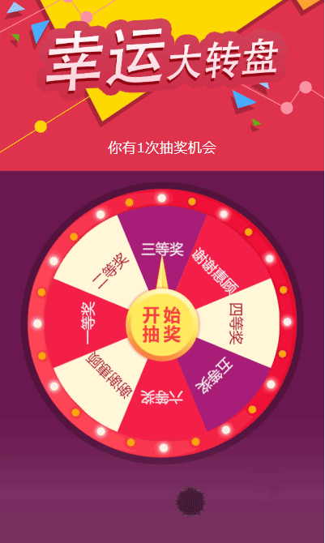
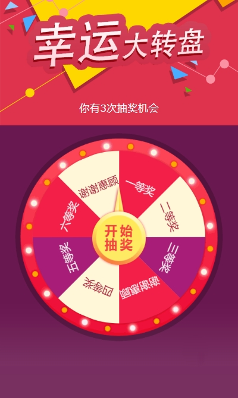

# 抽奖转盘游戏

[English](./readme_en.md) | 简体中文

一个精心设计的幸运转盘抽奖游戏，基于现代 Web 技术构建，提供流畅的动画效果和完整的抽奖体验。支持自定义奖品配置、动态修改转盘样式，并可以无缝集成到 iOS 和 Android 原生应用中。

特别适合:
- 营销活动和用户促活
- 会员奖励系统
- 游戏互动场景
- 节日活动抽奖

## 预览

### 动画效果


### 不同奖品数量效果
6个奖品样式：


8个奖品样式：



## 功能特点

- 流畅的转盘动画效果
- 支持自定义奖品配置
- 防作弊机制
- 响应式设计
- 原生应用交互支持
- 加载动画和模态框提示

## 使用说明

### 1. 基础配置

游戏初始化时可配置以下参数：
```javascript
const PRIZES = [
{
title: '手气不错哟～恭喜获得',
prize: '一等奖',
},
{
title: '手气不错哟～恭喜获得',
prize: '二等奖',
},
// ... 其他奖品配置
];
```
奖品区块会根据 PRIZES 数组自动生成，支持动态修改奖品数量和内容。

### 2. 颜色配置

转盘的颜色配置由两个数组控制：
```javascript
// 转盘背景颜色配置
const COLORS = ["#f31f49", "#fff7d7", "#a71d77"];

// 文字颜色配置
const TEXT_COLORS = ["#f3f1f1", "#a8213c", "#f3f1f1"];
```

转盘的每个奖品区块会依次使用这些颜色，当颜色用完后会循环使用。例如：
- 第1个奖品：背景色 #f31f49，文字颜色 #f3f1f1
- 第2个奖品：背景色 #fff7d7，文字颜色 #a8213c
- 第3个奖品：背景色 #a71d77，文字颜色 #f3f1f1
- 第4个奖品：背景色 #f31f49，文字颜色 #f3f1f1（循环使用）
- 以此类推...

### 3. 与原生应用交互

#### 3.1 从原生应用接收参数

- 设置抽奖次数：

```javascript
// iOS/Android 通过 postMessage 发送
{
    type: 'luckDrawCount',
    count: number // 剩余抽奖次数
}
```

#### 3.2 向原生应用发送结果

- 抽奖结果通知：

```javascript
// 发送给原生应用的数据格式
{
    type: 'drawResult',
    index: number,    // 中奖索引（0-4）
    prize: {
        title: string,  // 奖品标题
        prize: string   // 奖品内容
    }
}
```

### 4. 原生应用集成方法

#### iOS 集成

```swift
// WKScriptMessageHandler 实现
func userContentController(_ userContentController: WKUserContentController, 
                         didReceive message: WKScriptMessage) {
    if let dict = message.body as? [String: Any] {
        if dict["type"] as? String == "drawResult" {
            let index = dict["index"] as? Int ?? 0
            // 处理抽奖结果
        }
    }
}

// 设置抽奖次数
webView.evaluateJavaScript("setLuckDrawCount(\(count))", 
                         completionHandler: nil)
```

#### Android 集成

```kotlin
// WebView 接口类
class WebAppInterface(private val context: Context) {
    @JavascriptInterface
    fun sendMessage(message: String) {
        // 解析 JSON 字符串
        val jsonObject = JSONObject(message)
        if (jsonObject.getString("type") == "drawResult") {
            val index = jsonObject.getInt("index")
            // 处理抽奖结果
        }
    }
}

// 注册 JavaScript 接口
webView.addJavascriptInterface(WebAppInterface(this), "Android")

// 设置抽奖次数
webView.evaluateJavascript("setLuckDrawCount($count)", null)
```

### 5. 奖品位置说明

转盘奖品位置对应关系：
- index 0: 100元红包 (22.5°)
- index 1: 优惠券礼包 (157.5°)
- index 2: 5元代金券 (112.5°)
- index 3: 1元红包 (67.5°)
- index 4: 优惠券礼包 (202.5°)

## 注意事项

1. 确保网络环境良好，所有资源能够正常加载
2. 建议使用 HTTPS 协议部署
3. 建议使用现代浏览器访问，确保 CSS3 动画效果正常

## 浏览器兼容性

- Chrome 60+
- Safari 10+
- Firefox 54+
- iOS Safari 10+
- Android Browser 4.4+
- Chrome for Android 88+

## 文件结构

```
├── css/
│   └── style.css          # 样式文件
├── js/
│   └── game.js           # 游戏逻辑
├── images/               # 图片资源
│   ├── wheel-bg.png      # 转盘背景图
│   ├── game-arrow.png
│   ├── game-bg.png
│   └── game-title.png
├── screenshot/           # 预览图片
│   ├── screenFor6items.png
│   ├── screenFor8items.png
│   └── screenRecordingAnimation.gif
└── game.html            # 游戏主页面
```

#todo
- 添加动态生成奖品配置,根据传入的PRIZES传入的内容生成奖项的内容【done】
- 添加更多交互方式，初始化时可以通过传入参数来决定交互方式，通过arguments付入奖品配置，通过callback返回结果
- 增加打包输出到dist功能【done】