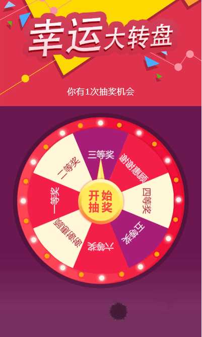
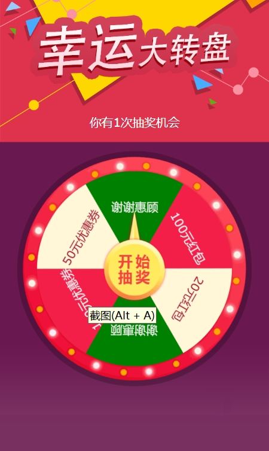
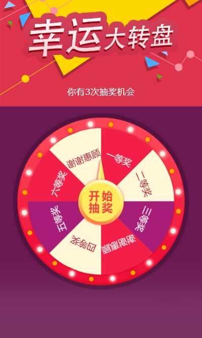

# Lucky Wheel Game

English | [简体中文](./README.md)

An elegantly designed lucky wheel game built with modern web technologies, offering smooth animations and a complete prize-drawing experience. Features customizable prize configurations, dynamic wheel styling, and seamless integration with iOS and Android native applications.

Perfect for:
- Marketing campaigns & user engagement
- Membership reward systems
- Interactive gaming scenarios
- Holiday event lucky draws

## Preview

### Animation Effect


### Different Prize Quantities
6 prizes style:



8 prizes style:



## Features

- Smooth wheel animation effects
- Customizable prize configuration
- Anti-cheating mechanism
- Responsive design
- Native application interaction support
- Loading animation and modal prompts

## Usage Guide

### 1. Basic Configuration

Configure the following parameters when initializing the game:
```javascript
const PRIZES = [
    {
        title: 'Congratulations! You won',
        prize: 'First Prize',
    },
    {
        title: 'Congratulations! You won',
        prize: 'Second Prize',
    },
    // ... other prize configurations
];
```
Prize sections will be automatically generated based on the PRIZES array, supporting dynamic modification of prize quantity and content.

### 2. Color Configuration

The wheel's colors are controlled by two arrays:
```javascript
// Wheel background colors
const COLORS = ["#f31f49", "#fff7d7", "#a71d77"];

// Text colors
const TEXT_COLORS = ["#f3f1f1", "#a8213c", "#f3f1f1"];
```

Each prize section will use these colors in sequence, cycling back to the beginning when all colors are used. For example:
- 1st prize: background #f31f49, text #f3f1f1
- 2nd prize: background #fff7d7, text #a8213c
- 3rd prize: background #a71d77, text #f3f1f1
- 4th prize: background #f31f49, text #f3f1f1 (cycling back)
- And so on...

### 3. Native Application Interaction

#### 3.1 Receiving Parameters from Native App

- Set draw count:

```javascript
// iOS/Android sends via postMessage
{
    type: 'luckDrawCount',
    count: number // remaining draw count
}
```

#### 3.2 Sending Results to Native App

- Draw result notification:

```javascript
// Data format sent to native app
{
    type: 'drawResult',
    index: number,    // prize index
    prize: {
        title: string,  // prize title
        prize: string   // prize content
    }
}
```

### 4. Native App Integration Methods

#### iOS Integration

```swift
// WKScriptMessageHandler implementation
func userContentController(_ userContentController: WKUserContentController, 
                         didReceive message: WKScriptMessage) {
    if let dict = message.body as? [String: Any] {
        if dict["type"] as? String == "drawResult" {
            let index = dict["index"] as? Int ?? 0
            // Handle draw result
        }
    }
}

// Set draw count
webView.evaluateJavaScript("setLuckDrawCount(\(count))", 
                         completionHandler: nil)
```

#### Android Integration

```kotlin
// WebView interface class
class WebAppInterface(private val context: Context) {
    @JavascriptInterface
    fun sendMessage(message: String) {
        // Parse JSON string
        val jsonObject = JSONObject(message)
        if (jsonObject.getString("type") == "drawResult") {
            val index = jsonObject.getInt("index")
            // Handle draw result
        }
    }
}

// Register JavaScript interface
webView.addJavascriptInterface(WebAppInterface(this), "Android")

// Set draw count
webView.evaluateJavascript("setLuckDrawCount($count)", null)
```

## Notes

1. Ensure good network connectivity for proper resource loading
2. Recommended to deploy using HTTPS protocol
3. Recommended to use modern browsers to ensure CSS3 animation effects work properly

## Browser Compatibility

- Chrome 60+
- Safari 10+
- Firefox 54+
- iOS Safari 10+
- Android Browser 4.4+
- Chrome for Android 88+

## File Structure

```
├── css/
│   └── style.css          # Style file
├── js/
│   └── game.js           # Game logic
├── images/               # Image resources
│   ├── wheel-bg.png      # Wheel background image
│   ├── game-arrow.png
│   ├── game-bg.png
│   └── game-title.png
├── screenshot/           # Preview images
│   ├── screenFor6items.png
│   ├── screenFor8items.png
│   └── screenRecordingAnimation.gif
└── game.html            # Game main page
```

#todo
- Add dynamic prize configuration based on PRIZES content [done]
- Add more interaction methods, initialize with parameters to determine interaction mode, pass prize configuration through arguments, return results through callback 